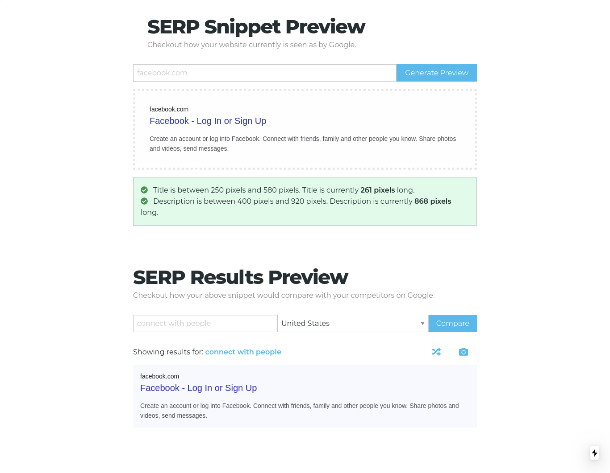

# SERP Snippet Preview

> A web application that lets you generate a Google SERP snippet from a website and compare with your competitors.



This is a [Next.js](https://nextjs.org/) project bootstrapped with [`create-next-app`](https://github.com/vercel/next.js/tree/canary/packages/create-next-app).

## Getting Started

First, run the development server:

```bash
npm run dev
# or
yarn dev
```

Open [http://localhost:3000](http://localhost:3000) with your browser to see the result.

You can start editing the page by modifying `pages/index.js`. The page auto-updates as you edit the file.

## Deploy on Vercel

[](https://vercel.com/new/git/external?repository-url=https://github.com/skdcodes/SERP-Snippet-Tool.NextJS_ReactJS_Foundation-CSS.Web.Freelancer)

## Learn More

To learn more about Next.js, take a look at the following resources:

- [Next.js Documentation](https://nextjs.org/docs) - learn about Next.js features and API.
- [Learn Next.js](https://nextjs.org/learn) - an interactive Next.js tutorial.
